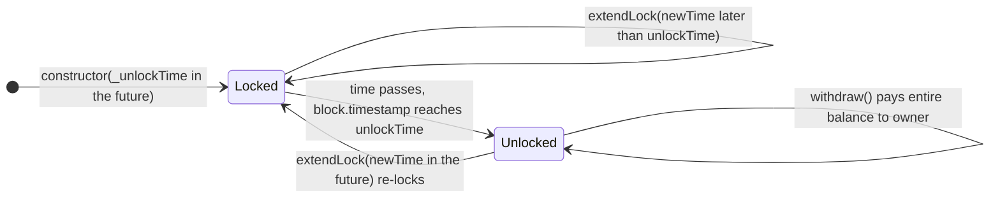
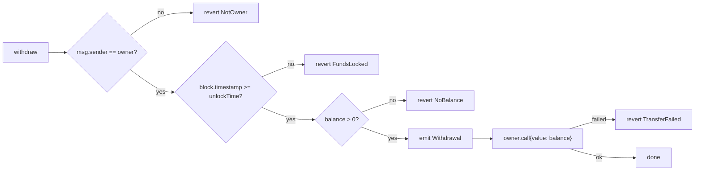

# PersonalVault: Time-Locked ETH Savings Vault

[](src/PersonalVault.sol)
[](#coverage)
[](LICENSE)

`PersonalVault` is a minimal, trustless "digital piggy bank" for Ethereum. The deployer becomes the vault's
owner and picks an unlock time. ETH can be added at any time, but nobody, not even the owner, can take it out
until the unlock time has passed. The owner can push the unlock time further into the future to keep saving,
but can never bring it closer. There is no admin, no upgrade path and no emergency exit. The only way ETH leaves
the vault is `withdraw()`, which always pays the owner and only works after the unlock time.

---

## Table of contents

- [Features](#features)
- [Contract API](#contract-api)
- [Architecture](#architecture)
- [Design decisions](#design-decisions)
- [Security considerations](#security-considerations)
- [Project structure](#project-structure)
- [Prerequisites](#prerequisites)
- [Setup](#setup)
- [Build](#build)
- [Test](#test)
- [Deploy to Sepolia](#deploy-to-sepolia)
- [Verify on Etherscan](#verify-on-etherscan)
- [Interacting with the vault](#interacting-with-the-vault)
- [Testing checklist mapping](#testing-checklist-mapping)
- [Deployment](#deployment)
- [License](#license)

---

## Features

- **Time-locked withdrawals**: `withdraw()` reverts with `FundsLocked()` until `block.timestamp >= unlockTime`.
- **Owner-only control**: only the deployer can withdraw or extend the lock (`onlyOwner` → `NotOwner()`).
- **Lock can only grow**: `extendLock(newTime)` requires `newTime > unlockTime` (and `newTime > now`);
  shortening reverts with `InvalidUnlockTime()`.
- **Re-lockable**: after unlocking, the owner can call `extendLock` again to lock the same vault for another
  savings period.
- **Flexible funding**: fund at deployment (`payable` constructor), via `deposit()`, or with a plain ETH
  transfer (`receive()`). Every inflow emits `Deposit(sender, amount)`.
- **Gas-efficient**: custom errors everywhere, `immutable` owner, no storage writes on deposit and a runtime
  bytecode of only 1,108 bytes.
- **UX helpers**: `isUnlocked()`, `timeUntilUnlock()` and `balance()` let wallets and front-ends show a
  countdown without doing timestamp maths.
- **Thoroughly tested**: 63 tests (unit, the brief's checklist as an end-to-end scenario, fuzz at 1,000 runs,
  and 7 handler-based invariants over 25,600 random calls), with 100% line, statement, branch and function
  coverage.
- **Scripted operations**: `Deploy.s.sol` (with a sanity check that catches millisecond timestamps) and
  `Interact.s.sol` (deposit / extendLock / withdraw / status), both covered by tests.

## Contract API

Source: [`src/PersonalVault.sol`](src/PersonalVault.sol). Every item has full NatSpec.

### State

| Name         | Type                        | Description                                                         |
| ------------ | --------------------------- | ------------------------------------------------------------------- |
| `owner`      | `address public immutable`  | The deployer. The only account that can withdraw or extend the lock. |
| `unlockTime` | `uint256 public`            | Unix timestamp (seconds) from which withdrawal is allowed. Never decreases. |

### Functions

| Function                                    | Access  | Description | Reverts with |
| ------------------------------------------- | ------- | ----------- | ------------ |
| `constructor(uint256 _unlockTime) payable`  | anyone  | Sets `owner = msg.sender` and `unlockTime`. Any ETH sent is locked and logged as a `Deposit`. | `InvalidUnlockTime` if `_unlockTime <= block.timestamp` |
| `deposit() payable`                         | anyone  | Adds `msg.value` to the vault and emits `Deposit`. | `ZeroDeposit` if `msg.value == 0` |
| `receive() payable`                         | anyone  | Plain ETH transfers go through the same logic as `deposit()`. | `ZeroDeposit` |
| `withdraw()`                                | owner   | Sends the **entire** balance to `owner` and emits `Withdrawal`. | `NotOwner`, `FundsLocked`, `NoBalance`, `TransferFailed` |
| `extendLock(uint256 newTime)`               | owner   | Sets `unlockTime = newTime` and emits `LockExtended`. | `NotOwner`; `InvalidUnlockTime` if `newTime <= unlockTime` or `newTime <= block.timestamp` |
| `isUnlocked() view returns (bool)`          | anyone  | `block.timestamp >= unlockTime`. | none |
| `timeUntilUnlock() view returns (uint256)`  | anyone  | Seconds left until unlock, `0` once unlocked. | none |
| `balance() view returns (uint256)`          | anyone  | ETH held by the vault, in wei. | none |

Calls with unknown calldata revert: there is intentionally no `fallback`.

### Events

| Event                                           | Emitted when |
| ----------------------------------------------- | ------------ |
| `Deposit(address indexed sender, uint256 amount)` | ETH enters the vault: constructor with value, `deposit()` or `receive()`. |
| `Withdrawal(uint256 amount, uint256 timestamp)`   | The owner successfully withdraws `amount` at `timestamp`. |
| `LockExtended(uint256 newUnlockTime)`             | The owner successfully extends the lock. |

### Errors

| Error                 | Thrown when |
| --------------------- | ----------- |
| `FundsLocked()`       | `withdraw()` is called while `block.timestamp < unlockTime`. |
| `NotOwner()`          | `withdraw()` or `extendLock()` is called by anyone other than `owner`. |
| `InvalidUnlockTime()` | The constructor receives a non-future time, or `extendLock` would not move the lock later into the future. |
| `NoBalance()`         | `withdraw()` is called on an empty vault (brief: "contract has balance > 0"). |
| `ZeroDeposit()`       | A deposit carries `0` wei. |
| `TransferFailed()`    | The ETH transfer to the owner fails (e.g. the owner is a contract that rejects ETH). |

The first three errors come from the brief; the last three are additions, explained [below](#design-decisions).

## Architecture

The vault is a single, self-contained contract with no inheritance and no external dependencies. Its only
lifecycle state is derived from `block.timestamp` compared with `unlockTime`; the ETH balance itself is the rest
of the state.



`withdraw()` follows Checks-Effects-Interactions:



## Design decisions

- **Custom error in the constructor instead of the brief's `require` string.** The brief's constructor example
  uses `require(_unlockTime > block.timestamp, "Unlock time must be in the future")`, but its security
  requirements say to use custom errors instead of require strings. The contract uses
  `if (_unlockTime <= block.timestamp) revert InvalidUnlockTime();`, which behaves the same, is cheaper to
  deploy and revert, and reuses the error the brief already defines for bad unlock times.
- **Immutable owner.** `owner` is declared `address public immutable owner`. It is still exposed exactly as the
  brief specifies (`owner()` getter), but because ownership is never transferable it is stored in bytecode: no
  SLOAD on every `onlyOwner` check, and no code path can ever change it.
- **Open deposits.** The brief says the "owner adds ETH", but restricting deposits would add no safety: funds can
  only ever leave to the owner, so a third-party deposit is effectively a gift that is locked under the same
  rules. Keeping deposits open lets family or friends contribute to someone's savings, and the
  `Deposit(address indexed sender, ...)` event, whose indexed `sender` field exists precisely to identify
  depositors, keeps every contribution auditable.
- **`receive()` routes through `_deposit()`.** Plain transfers from any wallet work and are logged identically,
  with no duplicated logic. There is deliberately **no `fallback`**, so calls with mistyped selectors or random
  calldata revert instead of silently swallowing ETH.
- **Extra errors where the brief requires a check but names no error:**
  - `NoBalance()`: the brief requires "contract has balance > 0" for withdraw. This makes the brief's last
    checklist item ("withdraw again → should fail") revert with a meaningful reason, and avoids emitting a
    pointless `Withdrawal(0, ...)`.
  - `ZeroDeposit()`: a zero-value deposit is almost certainly a mistake and would emit a misleading
    `Deposit(sender, 0)` event. The constructor still allows deploying with no value, because funding later is
    a normal flow; it simply emits no event in that case.
  - `TransferFailed()`: the result of the low-level `call` is always checked; a failure reverts the whole
    transaction, so the funds stay in the vault rather than being lost or left in an inconsistent state.
- **`extendLock` also requires `newTime > block.timestamp`.** After the vault unlocks, a `newTime` that is later
  than the old `unlockTime` but already in the past would be an "extension" with no effect. It is rejected with
  the same `InvalidUnlockTime()` error. A future `newTime` is accepted and re-locks the vault.
- **Check order in `withdraw`.** The brief lists the time check before the owner check; the contract uses the
  brief's mandated `onlyOwner` modifier, which runs first. Both conditions must hold either way. Checking access
  first is the conventional pattern and gives a non-owner a consistent `NotOwner()` regardless of the lock
  state.
- **Balance-based accounting.** The vault does not keep its own balance counter; `withdraw()` sends
  `address(this).balance`. This keeps deposits storage-free (about 22.7k gas) and guarantees that *all* ETH,
  including ETH force-sent without calling the contract, is recoverable by the owner.
- **No upgradeability, pause or factory.** For a self-custody time lock, immutability *is* the feature: an
  upgrade key, a pause switch or an admin rescue function would be a backdoor around the lock. Each user deploys
  their own vault; a factory could be added on top later without touching this contract.
- **Push payment to a single, fixed recipient.** The usual "pull over push" advice protects multi-recipient
  payouts from griefing. Here the only recipient is the caller (the owner) withdrawing their own funds, so
  pushing in the same transaction is the simplest correct design.

## Security considerations

| Topic | How it is handled |
| ----- | ----------------- |
| **Reentrancy** | `withdraw()` follows Checks-Effects-Interactions: all checks run and the event is emitted before the single external call. There is no internal accounting to corrupt, and when the owner's code runs the vault balance is already zero, so a nested `withdraw()` reverts with `NoBalance()`. This is proven by `test_Withdraw_ReentrantOwnerCannotDoubleWithdraw`, using a malicious owner contract that re-enters from `receive()`. A `ReentrancyGuard` would add gas without adding protection. |
| **Access control** | `withdraw` and `extendLock` use `onlyOwner`, which compares `msg.sender` with the immutable `owner`. Ownership cannot be transferred or renounced, so there is no ownership-takeover surface. Fuzz and invariant tests confirm that no other address can call either function successfully. |
| **`tx.origin`** | Never used. Authorization is `msg.sender`-based, so phishing contracts cannot act on the owner's behalf. |
| **ETH transfer** | Uses `call{value: amount}("")` with the result checked (`TransferFailed`), never `transfer`/`send`. Their 2300-gas stipend breaks smart-contract wallets (Safe, ERC-4337 accounts) as owners. |
| **Timestamp dependence** | The lock relies on `block.timestamp`. Since the Merge, Ethereum slots are fixed 12-second intervals and a proposer cannot meaningfully shift timestamps; even historically the skew was limited to seconds. That is negligible for lock periods of minutes or longer, which is the intended use. `block.timestamp` is never used for randomness. (Forge's `block-timestamp` lint is disabled in `foundry.toml` for this reason.) |
| **Integer overflow** | Solidity 0.8 checked arithmetic. The only `unchecked` block, in `timeUntilUnlock`, is guarded by the comparison right before it. |
| **Input validation** | Unlock times must be in the future (constructor and `extendLock`), extensions must be strictly later, and deposits must be non-zero. The zero address cannot become the owner, because `owner = msg.sender`. |
| **Front-running / MEV** | There is nothing to front-run: no prices or orders, and withdrawals always pay the fixed owner no matter who sees the transaction first. |
| **Delegatecall / oracles / flash loans** | Not used and not applicable. The contract has no external dependencies. |
| **Force-sent ETH** | ETH can arrive without calling the contract (e.g. `selfdestruct` or as a block reward recipient). Because `withdraw()` sends `address(this).balance`, that ETH is still withdrawable by the owner (`test_Withdraw_IncludesForceSentEther`). |
| **No admin backdoor** | There is no owner override, pause or rescue function, so the lock is enforced for everyone. **If the owner loses their key, the funds are irrecoverable**, and an owner contract that cannot receive ETH can never withdraw (its withdrawals revert with `TransferFailed`). Deploy from an account that can receive ETH and that you will control at unlock time. |
| **Very long locks** | The contract accepts any future `uint256` timestamp (the brief says the lock just has to be in the future). A JavaScript millisecond timestamp would lock funds for roughly 50,000 years, so `Deploy.s.sol` rejects unlock times more than 10 years away (`UnlockTimeTooFar`). Double-check `extendLock` arguments too: extensions are irreversible. |

## Project structure

```text
.
├── foundry.toml                        # compiler, fuzz/invariant, lint, RPC and Etherscan config
├── foundry.lock                        # pinned forge-std version
├── .env.example                        # placeholder environment variables (no keys)
├── lib/forge-std/                      # git submodule (testing/scripting library)
├── src/
│   └── PersonalVault.sol               # the vault contract
├── script/
│   ├── Deploy.s.sol                    # deployment (UNLOCK_TIME / LOCK_DURATION / INITIAL_DEPOSIT)
│   └── Interact.s.sol                  # deposit / extendLock / withdraw / status helpers
└── test/
    ├── PersonalVault.t.sol             # unit tests: every function, revert path and event
    ├── PersonalVault.checklist.t.sol   # the brief's Testing Checklist as one end-to-end scenario
    ├── PersonalVault.fuzz.t.sol        # property-based fuzz tests (1,000 runs each)
    ├── Scripts.t.sol                   # tests for Deploy.s.sol and Interact.s.sol
    ├── invariant/
    │   ├── PersonalVault.invariant.t.sol   # 7 stateful invariants
    │   └── VaultHandler.sol                # handler with ghost variables
    ├── mocks/
    │   ├── RejectingOwner.sol          # owner contract that rejects ETH (TransferFailed path)
    │   └── ReentrantOwner.sol          # malicious owner that re-enters withdraw()
    └── utils/
        └── VaultTestBase.sol           # shared fixture and helpers
```

## Prerequisites

- [Foundry](https://getfoundry.sh) (`forge`, `cast`; developed with 1.8.5). Install with:
  ```bash
  curl -L https://foundry.paradigm.xyz | bash && foundryup
  ```
- Git (forge-std is a git submodule).
- For Sepolia: an RPC URL (Infura, Alchemy, a public endpoint, etc.), an
  [Etherscan API key](https://etherscan.io/myapikey) and a funded Sepolia account
  ([faucets](https://ethereum.org/en/developers/docs/networks/#sepolia)).

Dependencies: only [forge-std](https://github.com/foundry-rs/forge-std) (v1.17.0, tests and scripts only).
The contract itself has **zero** dependencies. The compiler is pinned to `solc 0.8.30` (EVM version `prague`),
and Foundry downloads it automatically.

## Setup

```bash
git clone --recursive <REPO_URL> ethereum-personal-vault
cd ethereum-personal-vault

# If you cloned without --recursive:
forge install            # or: git submodule update --init --recursive

cp .env.example .env     # then fill in SEPOLIA_RPC_URL and ETHERSCAN_API_KEY
```

Set up a signer **without** putting a key in the repo or in `.env`. An encrypted Foundry keystore is the
recommended option:

```bash
cast wallet import deployer --interactive   # paste the key once; it is stored encrypted in ~/.foundry/keystores
cast wallet address --account deployer
```

## Build

```bash
forge build          # compile (lint runs automatically; the build is warning-free)
forge build --sizes  # runtime size: 1,108 B / initcode: 1,316 B
forge fmt --check    # formatting check (run `forge fmt` to fix)
```

## Test

```bash
forge test                                   # all 63 tests
forge test -vvv                              # with traces for failures
forge test --match-contract Checklist -vvvv  # the brief's checklist scenario with full traces
forge test --match-path "test/invariant/*"   # invariant suite only
forge test --gas-report                      # per-function gas usage
forge snapshot                               # write .gas-snapshot (use `--diff` / `--check` to compare)
forge coverage --report summary --no-match-coverage "test"
```

| Suite | File | Tests |
| ----- | ---- | ----- |
| Unit | `test/PersonalVault.t.sol` | 40 |
| Brief checklist (end-to-end) | `test/PersonalVault.checklist.t.sol` | 1 |
| Fuzz (1,000 runs each) | `test/PersonalVault.fuzz.t.sol` | 14 |
| Scripts | `test/Scripts.t.sol` | 7 |
| Invariants (256 runs × 100 calls) | `test/invariant/PersonalVault.invariant.t.sol` | 7 invariants |

**Invariants** checked after every random call sequence:

1. `unlockTime` never decreases and never drops below its initial value.
2. No withdrawal ever succeeds while `block.timestamp < unlockTime`.
3. No non-owner ever successfully calls `withdraw` or `extendLock`.
4. Attempts to keep or shorten `unlockTime` always revert.
5. Liveness: once unlocked, an owner withdrawal of a non-empty vault always succeeds.
6. Vault balance == total deposited − total withdrawn.
7. Only the owner ever receives ETH; other depositors' balances only ever decrease by what they deposited.

These invariants were validated by mutation: removing the `FundsLocked` check, or dropping the
`newTime <= unlockTime` condition, makes the relevant invariants fail.

### Coverage

`forge coverage --report summary --no-match-coverage "test"`:

| File                    | Lines           | Statements      | Branches      | Functions       |
| ----------------------- | --------------- | --------------- | ------------- | --------------- |
| `src/PersonalVault.sol` | 100% (33/33)    | 100% (37/37)    | 100% (9/9)    | 100% (10/10)    |
| `script/Deploy.s.sol`   | 100% (17/17)    | 100% (17/17)    | 100% (4/4)    | 100% (3/3)      |
| `script/Interact.s.sol` | 100% (37/37)    | 100% (37/37)    | 100% (3/3)    | 100% (7/7)      |

### Gas (from `forge test --gas-report`)

| Function | Typical gas |
| -------- | ----------- |
| `deposit()` | ~22,700 |
| `receive()` (plain transfer) | ~22,500 |
| `extendLock()` | ~27,700 |
| `withdraw()` (successful, EOA owner) | ~31,700 |
| Views (`isUnlocked`, `timeUntilUnlock`, `unlockTime`) | ~2,300 |

## Deploy to Sepolia

`script/Deploy.s.sol` reads (all optional):

| Variable | Meaning | Default |
| -------- | ------- | ------- |
| `UNLOCK_TIME` | Absolute unix timestamp in **seconds**. Takes precedence over `LOCK_DURATION`. | unset |
| `LOCK_DURATION` | Seconds from the deployment block until unlock. | `600` (10 minutes) |
| `INITIAL_DEPOSIT` | Wei to lock at deployment. | `0` |

The broadcasting account becomes the owner. No key is read from the environment; pass the signer as a CLI flag.

```bash
source .env

# Dry run (simulation against Sepolia state, nothing is sent):
forge script script/Deploy.s.sol --rpc-url sepolia --account deployer

# Deploy + verify on Etherscan in one go:
forge script script/Deploy.s.sol --rpc-url sepolia --account deployer --broadcast --verify -vvvv \
  --skip-simulation --gas-estimate-multiplier 130

# Alternatives for the signer:
#   --private-key "$(cat /secure/path/sepolia.key)"   (key file kept outside the repo)
#   --ledger / --trezor
```

`--skip-simulation` lets the node estimate gas: Foundry's local EVM under-prices contract creation compared
with Sepolia's current gas schedule, and the locally estimated limit runs out of gas on-chain.

The script logs the vault address, owner and unlock time. Use a lock of at least ~10 minutes so there is time
to send the deposit and the deliberately failing early withdrawal before it unlocks. Example with an absolute
time 15 minutes from now:

```bash
UNLOCK_TIME=$(( $(date +%s) + 900 )) INITIAL_DEPOSIT=0 \
  forge script script/Deploy.s.sol --rpc-url sepolia --account deployer --broadcast --verify \
    --skip-simulation --gas-estimate-multiplier 130
```

## Verify on Etherscan

`--verify` above verifies automatically using the `[etherscan]` key in `foundry.toml`. To verify manually,
for example if the deployment succeeded but verification timed out:

```bash
forge verify-contract "$VAULT_ADDRESS" src/PersonalVault.sol:PersonalVault \
  --chain sepolia \
  --constructor-args "$(cast abi-encode 'constructor(uint256)' <UNLOCK_TIME_USED_AT_DEPLOY>)" \
  --watch
```

The unlock time used at deployment is printed by the script and is also readable with
`cast call $VAULT_ADDRESS "unlockTime()(uint256)" --rpc-url sepolia`, as long as `extendLock` has not been
called yet.

Without an Etherscan API key, Sourcify and Blockscout verify for free:

```bash
ARGS=$(cast abi-encode 'constructor(uint256)' <UNLOCK_TIME_USED_AT_DEPLOY>)
forge verify-contract "$VAULT_ADDRESS" src/PersonalVault.sol:PersonalVault --chain sepolia \
  --verifier sourcify --constructor-args "$ARGS" --watch
forge verify-contract "$VAULT_ADDRESS" src/PersonalVault.sol:PersonalVault --chain sepolia \
  --verifier blockscout --verifier-url https://eth-sepolia.blockscout.com/api/ --constructor-args "$ARGS" --watch
```

For Etherscan's web form ("Solidity (Standard-Json-Input)"), export the exact compiler input with
`forge verify-contract ... --show-standard-json-input > PersonalVault.standard-input.json` and enter
compiler `v0.8.30+commit.73712a01`, license MIT, and the ABI-encoded constructor arguments.

## Interacting with the vault

Set `VAULT_ADDRESS` in `.env` (and `source .env`) first.

### Read state (free)

```bash
cast call $VAULT_ADDRESS "owner()(address)"            --rpc-url sepolia
cast call $VAULT_ADDRESS "unlockTime()(uint256)"       --rpc-url sepolia
cast call $VAULT_ADDRESS "isUnlocked()(bool)"          --rpc-url sepolia
cast call $VAULT_ADDRESS "timeUntilUnlock()(uint256)"  --rpc-url sepolia
cast call $VAULT_ADDRESS "balance()(uint256)"          --rpc-url sepolia

# or everything at once:
forge script script/Interact.s.sol --rpc-url sepolia
```

### 1. Deposit

```bash
cast send $VAULT_ADDRESS "deposit()" --value 0.001ether --rpc-url sepolia --account deployer
# a plain transfer works too:
cast send $VAULT_ADDRESS --value 0.001ether --rpc-url sepolia --account deployer
# or via script (DEPOSIT_AMOUNT in wei, default 0.001 ETH):
forge script script/Interact.s.sol --sig "deposit()" --rpc-url sepolia --account deployer --broadcast
```

### 2. Failed early withdrawal (on-chain revert with `FundsLocked()`)

`cast send` normally estimates gas first; the estimate reverts, so nothing is sent. Passing `--gas-limit`
skips estimation and forces the transaction on-chain, where it is mined with status `0` (failed). This is the
"failed early withdrawal" deliverable:

```bash
cast send $VAULT_ADDRESS "withdraw()" --gas-limit 100000 --rpc-url sepolia --account deployer
```

Check the receipt and decode the revert reason:

```bash
cast receipt <TX_HASH> status --rpc-url sepolia        # 0 = reverted
cast run <TX_HASH> --rpc-url sepolia                   # trace shows FundsLocked()
cast sig "FundsLocked()"                               # 0x437b0392, matches the revert data
```

(`forge script` cannot produce this transaction: it simulates first and refuses to broadcast a reverting call.)

### 3. Extend the lock

```bash
NEW_TIME=$(( $(cast call $VAULT_ADDRESS "unlockTime()(uint256)" --rpc-url sepolia) + 300 ))
cast send $VAULT_ADDRESS "extendLock(uint256)" $NEW_TIME --rpc-url sepolia --account deployer
# or via script (NEW_UNLOCK_TIME absolute, or EXTEND_BY seconds, default 300):
forge script script/Interact.s.sol --sig "extendLock()" --rpc-url sepolia --account deployer --broadcast
```

### 4. Withdraw after unlock

```bash
cast call $VAULT_ADDRESS "timeUntilUnlock()(uint256)" --rpc-url sepolia   # wait until this is 0
cast send $VAULT_ADDRESS "withdraw()" --rpc-url sepolia --account deployer
# or:
forge script script/Interact.s.sol --sig "withdraw()" --rpc-url sepolia --account deployer --broadcast
```

### Error selectors (for decoding reverts)

| Error | Selector |
| ----- | -------- |
| `FundsLocked()` | `0x437b0392` |
| `NotOwner()` | `0x30cd7471` |
| `InvalidUnlockTime()` | `0xa5574da6` |
| `NoBalance()` | `0xc2caa2a6` |
| `ZeroDeposit()` | `0x56316e87` |
| `TransferFailed()` | `0x90b8ec18` |

## Testing checklist mapping

Every step of the brief's Testing Checklist is reproduced, in order, in
`test_BriefTestingChecklist_EndToEnd` (`test/PersonalVault.checklist.t.sol`), and each one also has focused
unit tests:

| Brief checklist item | End-to-end step | Focused tests |
| -------------------- | --------------- | ------------- |
| Deploy contract with unlockTime = 5 minutes from now | step 1 | `test_Constructor_SetsOwnerAndUnlockTime`, `test_Constructor_RevertsWhen_UnlockTimeIsNow`, `test_Constructor_RevertsWhen_UnlockTimeInPast`, `testFuzz_Constructor_*` |
| Deposit 1 ETH → should succeed, emit Deposit event | step 2 | `test_Deposit_ByOwner_EmitsEventAndIncreasesBalance`, `test_Receive_PlainTransferIsDeposit`, `testFuzz_Deposit_*` |
| Try withdraw immediately → should revert with FundsLocked() | step 3 | `test_Withdraw_RevertsWhen_Locked`, `test_Withdraw_RevertsWhen_OneSecondBeforeUnlock`, `testFuzz_Withdraw_RevertsAnyTimeBeforeUnlock` |
| Extend lock to 10 minutes → should succeed | step 4 | `test_ExtendLock_UpdatesUnlockTimeAndEmits`, `test_ExtendLock_BlocksWithdrawUntilNewTime`, `testFuzz_ExtendLock_AcceptsAnyLaterTime` |
| Try extend lock to 3 minutes → should fail (cannot reduce) | step 5 | `test_ExtendLock_RevertsWhen_Shortened`, `test_ExtendLock_RevertsWhen_SameTime`, `testFuzz_ExtendLock_RevertsWhenNotLater`, `invariant_LockCanNeverBeShortened` |
| Fast forward time to after unlock | step 6 | `test_IsUnlocked_FlipsExactlyAtUnlockTime`, `test_TimeUntilUnlock_CountsDownToZero` |
| Withdraw as owner → should succeed, receive all ETH | step 7 | `test_Withdraw_AfterUnlock_SendsEntireBalanceAndEmits`, `test_Withdraw_SucceedsAtExactUnlockTime`, `testFuzz_Withdraw_SucceedsAnyTimeAfterUnlock` |
| Try withdraw again → should fail (no balance) | step 8 | `test_Withdraw_RevertsWhen_NoBalance` |

Brief success criteria and pitfalls are covered too: non-owner withdraw and extend
(`test_Withdraw_RevertsWhen_NotOwner*`, `test_ExtendLock_RevertsWhen_NotOwner`, fuzz and invariant variants),
`call` instead of `transfer` (`test_Withdraw_RevertsWhen_OwnerRejectsEther`), CEI/reentrancy
(`test_Withdraw_ReentrantOwnerCannotDoubleWithdraw`) and events for every state change (`vm.expectEmit` in
each happy-path test).

## Deployment

Deployed to **Sepolia** on 2026-10-08 with `script/Deploy.s.sol` (`LOCK_DURATION=480`), then exercised
on-chain with `cast` to produce the brief's deliverable transactions.

| Item | Value |
| ---- | ----- |
| Network | Sepolia (chain id 11155111) |
| Contract address | [`0xCb21D40e224Cb6894B1267b77Cb6eDd357c39d0C`](https://sepolia.etherscan.io/address/0xCb21D40e224Cb6894B1267b77Cb6eDd357c39d0C) |
| Etherscan | https://sepolia.etherscan.io/address/0xCb21D40e224Cb6894B1267b77Cb6eDd357c39d0C |
| Etherscan verified code (exact match) | https://sepolia.etherscan.io/address/0xCb21D40e224Cb6894B1267b77Cb6eDd357c39d0C#code |
| Sourcify (exact match) | https://repo.sourcify.dev/11155111/0xCb21D40e224Cb6894B1267b77Cb6eDd357c39d0C |
| Blockscout (verified) | https://eth-sepolia.blockscout.com/address/0xCb21D40e224Cb6894B1267b77Cb6eDd357c39d0C?tab=contract |
| Deployer / owner | [`0xc403493F865A2BAD1459f711E8f4a7335ee92ef1`](https://sepolia.etherscan.io/address/0xc403493F865A2BAD1459f711E8f4a7335ee92ef1) |
| Initial unlock time | `1791459372` (2026-10-08 11:36:12 UTC) |
| Unlock time after `extendLock` | `1791459432` (2026-10-08 11:37:12 UTC) |
| Compiler | solc `0.8.30+commit.73712a01`, optimizer on (200 runs), EVM version `prague`, no via-IR |
| Constructor arguments (ABI-encoded) | `0x000000000000000000000000000000000000000000000000000000006ac7802c` |

**Transactions**

| Step | Result | Transaction |
| ---- | ------ | ----------- |
| Deploy `PersonalVault` | ✅ success | [`0x224ceb0b…441066b4`](https://sepolia.etherscan.io/tx/0x224ceb0bf1e0ed8e468ef8b62f332b396db314dd4a32567682856515441066b4) |
| `deposit()` 0.01 ETH | ✅ success, emits `Deposit` | [`0x423cdde1…1c16945e`](https://sepolia.etherscan.io/tx/0x423cdde15e3be47e5975e94c409cc6b87150f037acb9ccd82f211dc81c16945e) |
| `withdraw()` before unlock | ❌ reverted on-chain with `FundsLocked()` (as intended) | [`0x3859449f…554f16c5`](https://sepolia.etherscan.io/tx/0x3859449f4292783361edecca12d4f3d4ddbd15a8ebd528d969d96d81554f16c5) |
| `extendLock(1791459432)` | ✅ success, emits `LockExtended` | [`0xc7269361…90ba39b0`](https://sepolia.etherscan.io/tx/0xc7269361503ddd793b327ab2f44c7fd06705dd925270828963b55c1590ba39b0) |
| `withdraw()` after unlock | ✅ success, 0.01 ETH returned to owner, emits `Withdrawal` | [`0xb507df7c…a84ffd8a`](https://sepolia.etherscan.io/tx/0xb507df7cef5103fdebfc015407d66ec33b8a1c63541a327812ce5000a84ffd8a) |

Full hashes:

```text
deploy           0x224ceb0bf1e0ed8e468ef8b62f332b396db314dd4a32567682856515441066b4
deposit          0x423cdde15e3be47e5975e94c409cc6b87150f037acb9ccd82f211dc81c16945e
early withdraw   0x3859449f4292783361edecca12d4f3d4ddbd15a8ebd528d969d96d81554f16c5  (reverted: FundsLocked)
extendLock       0xc7269361503ddd793b327ab2f44c7fd06705dd925270828963b55c1590ba39b0
withdraw         0xb507df7cef5103fdebfc015407d66ec33b8a1c63541a327812ce5000a84ffd8a
```

> **Gas note:** Sepolia's current gas schedule charges far more for contract creation than Foundry's
> local simulation (≈2.05M vs ≈0.41M gas), so a first `forge script --broadcast` attempt ran out of gas.
> Deploy with `--skip-simulation` (gas estimated by the node) as shown in
> [Deploy to Sepolia](#deploy-to-sepolia).

## License

[MIT](LICENSE) © 2026 Faiz A
